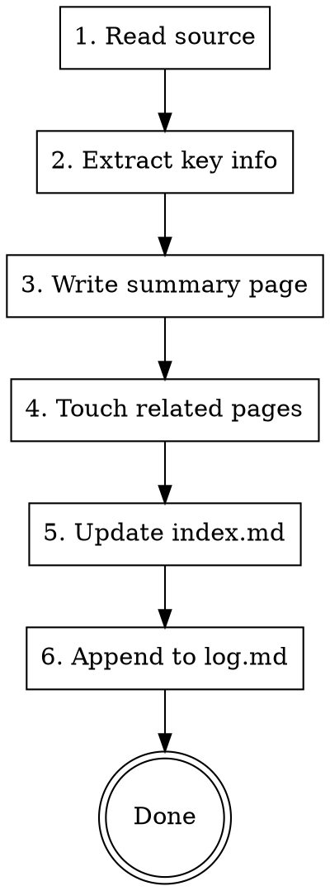

# Ingest

The **Ingest** operation from Andrej Karpathy's [LLM Wiki pattern](https://gist.github.com/karpathy/442a6bf555914893e9891c11519de94f). This is the universal entry point for any source material coming into a personal knowledge base: media URLs, existing markdown, web articles, PDFs, pasted text.

> **Vault setup required.** This skill assumes you have a personal knowledge base organized as a markdown vault (Obsidian-compatible works great, but any directory of markdown will do). Before using this skill:
>
> 1. **Read Karpathy's original writeup:** [gist.github.com/karpathy/442a6bf555914893e9891c11519de94f](https://gist.github.com/karpathy/442a6bf555914893e9891c11519de94f). It explains the "LLM is the programmer, markdown is the codebase, vault is the IDE" thesis the skill is built on.
> 2. **Create a vault directory** at a stable location (e.g., `~/vault/`, `~/Documents/notes/`).
> 3. **Seed the structure:**
>    ```bash
>    mkdir -p ~/vault/{00-Inbox,10-Projects,20-Areas,30-People,40-Ideas,50-References,raw}
>    touch ~/vault/index.md ~/vault/log.md
>    ```
>    `index.md` is the LLM-maintained catalog. `log.md` is the append-only operation record. `raw/` holds immutable source material.
> 4. **Point Claude at it.** Add a line to your `~/.claude/CLAUDE.md`:
>    ```
>    My personal knowledge base lives at `~/vault/`.
>    ```
>    This skill will use that path when it writes. Paths below are shown as `<vault>/...` as a placeholder.
>
> See the [repo README](../README.md#using-these-skills-with-your-own-notes) for the full setup walkthrough.

## The Ingest Loop (non-negotiable)

Every ingest, regardless of source type, does these steps:



Skip none of these. Bulk mode may batch, but every source gets an index entry and a log line.

## Source Types

### Type A: Existing markdown file (bulk-friendly)

Trigger: user points at a file path, or invokes bulk ingest over a directory.

1. **Read** the file.
2. **Classify** by content. Is it:
   - Research synthesis / deep-dive -> `<vault>/50-References/`
   - Raw transcript, article, paper -> `<vault>/raw/<domain>/` (immutable copy or symlink)
   - Business idea, angle, thesis -> `<vault>/40-Ideas/<slug>.md`
   - Project-specific milestone, decision, history -> `<vault>/10-Projects/<Project>.md` append to `## History`
   - Person note -> `<vault>/30-People/<Name>.md`
   - Life admin -> `<vault>/20-Areas/<domain>/<topic>.md`
   - Operational log, config, dead boilerplate -> **SKIP** (note in log.md as skipped)
3. **Extract** the core claim, 3-5 key takeaways, any named entities (people, tools, projects) worth wikilinking.
4. **Write** a summary page at the chosen destination. Use this frontmatter:
   ```yaml
   ---
   title: <Title>
   type: reference | idea | raw
   source: <original absolute path>
   ingested: YYYY-MM-DD
   tags: [topic1, topic2]
   ---
   ```
5. **Aggressively wikilink** every named entity on first mention: `[[Person]]`, `[[Project]]`, `[[Concept]]`, `[[Tool]]`. This is what makes the graph navigable.
6. **Touch related pages.** If the new content updates, contradicts, or extends an existing page, add a line there too. Cross-refs are the whole point.
7. **Update `index.md`.** Add a one-line entry under the correct section: `[[New Page]] - one-line summary (ingested: date)`.
8. **Append to `log.md`:**
   ```
   ## [YYYY-MM-DD] ingest | <Title>
   Source: <original path>. Touched: <N> vault pages.
   ```

### Type B: Media URL (YouTube / podcast / direct media)

Transcript acquisition + deep-dive synthesis flow.

**Input formats:**
```
/ingest <url>                              # single video/episode
/ingest <url1> <url2> <url3>               # multiple URLs
/ingest @<youtube-handle>                  # last 5 videos (default)
/ingest @<youtube-handle> --last 10
/ingest @<youtube-handle> --since YYYY-MM-DD
/ingest <url> --quick                      # combined synthesis only, skip per-source deep-dives
```

**Pipeline:**

1. **Parse input.** Extract URLs, `@handle`, flags. Detect source type per input:
   - `youtube.com/watch`, `youtu.be/`, `youtube.com/shorts/` -> YouTube
   - `@handle` -> YouTube channel, resolve to video list
   - RSS feed, podcast host domains -> podcast
   - Direct `.mp3/.mp4/.wav/.m4a` -> direct media
   - Other URL -> try `yt-dlp` first

2. **Acquire transcript:**

   **YouTube:**
   ```bash
   yt-dlp --write-auto-subs --sub-langs "en.*" --sub-format srt --skip-download \
     --print "%(title)s|||%(channel)s|||%(upload_date)s|||%(duration_string)s|||%(id)s" \
     -o "/tmp/research-%(id)s" "<URL>"
   ```
   Clean the `.srt`: strip sequence numbers, timestamps, HTML tags, dedupe repeats, collapse whitespace. Save to `/tmp/research-<id>-clean.txt`.

   If no captions: check for a transcription tool (e.g., an MCP that wraps whisper). If available, download audio with `yt-dlp -x --audio-format wav` and call the transcriber. If not available, report and skip the source.

   **@creator resolution:**
   ```bash
   yt-dlp --flat-playlist --print "%(id)s|||%(title)s|||%(upload_date)s" \
     --playlist-end <N> "https://www.youtube.com/@<handle>/videos"
   ```
   Apply `--last N` via `--playlist-end`. For `--since`, fetch extra and filter by `upload_date`.

   **Podcasts:** fetch RSS, parse XML, download most recent episode enclosure. Transcribe via available tool.

   **Direct media:** download, transcribe.

   On any acquisition failure: log error, skip source, continue.

3. **Save raw transcript** to `<vault>/raw/transcripts/<YYYY-MM-DD>-<slug>.md` with source metadata in frontmatter. Raw is immutable, this is the permanent record.

4. **Synthesize** into a deep-dive at `<vault>/50-References/deep-dives/<YYYY-MM-DD>-<slug>.md`:

   ```markdown
   ---
   title: <Title>
   type: reference
   source_url: <URL>
   creator: <channel/show>
   source_date: <YYYY-MM-DD>
   ingested: <today>
   raw: [[raw/transcripts/YYYY-MM-DD-slug]]
   tags: []
   ---

   # <Title>

   ## TL;DR
   2-3 sentence distillation of the core thesis. Not a summary, the central argument.

   ## Key Findings
   - [pattern] <concrete pattern with example>
   - [tool] <specific tool/technique with context>
   - [workflow] <process described>
   - [principle] <underlying mental model>
   - [anti-pattern] <what NOT to do, with reasoning>

   ## Detailed Analysis
   Organize by theme. For each:
   - State claim or insight
   - Specific evidence from source
   - Observation ("they do X") vs recommendation ("X is right")
   - Cross-reference against existing vault pages with wikilinks

   ## Contradictions & Tensions
   What conflicts with other sources or conventional wisdom? Most interesting findings.

   ## Gaps & Open Questions
   What does this source NOT address?

   ## Actionable Takeaways
   Concrete things to do. Specific enough to act on without re-reading.

   ## Related
   [[wikilinks to related vault pages]]
   ```

5. **Never summarize. Synthesize.** Summarization compresses; synthesis produces new understanding. Every pattern needs a concrete example. Track provenance.

6. **Master synthesis** (for multi-source or `--quick`):
   Write to `<vault>/50-References/syntheses/<YYYY-MM-DD>-<topic-slug>.md`. Cross-source patterns, contradictions, composite takeaways.

7. **Touch related vault pages** (step 4 of the core loop). Update `[[Person]]` pages if the source mentions them, update `[[Project]]` pages if it's build-in-public material about an active project, etc.

8. **Update `index.md`** and **append to `log.md`** (steps 5-6 of the core loop).

### Type C: Web article / PDF / dropped text

Trigger: user pastes a URL, drops a PDF, or pastes text directly.

1. For web articles: WebFetch to get the content.
2. For PDFs: Read the file with the `pages` parameter.
3. For pasted text: use it directly.
4. Save the source to `<vault>/raw/articles/<YYYY-MM-DD>-<slug>.md` (with source URL in frontmatter).
5. From there, follow the same synthesize -> write -> touch -> index -> log flow as Type B.

## Bulk Ingest Mode

When processing many files at once (e.g., "ingest everything under ~/projects/*/research/"):

- **Batch the log entries.** One log block per batch, not per file. Format:
  ```
  ## [YYYY-MM-DD] ingest | bulk batch - <batch description>
  <N> files ingested. <M> skipped as boilerplate. Destinations: <50-References: X, raw: Y, 40-Ideas: Z>.
  See vault-log entries: [[50-References/batch-<date>-manifest]] for per-file detail.
  ```
- **Write a batch manifest** at `<vault>/50-References/batch-<date>-manifest.md` with the full per-file table.
- **Skip without asking** for: CLAUDE.md, SESSION-CONTEXT.md, README.md, package.json, tsconfig.json, node_modules, .next, dist, build, .git. These are project config, not knowledge.
- **De-dupe within batch:** if two input files are near-identical (>90% content overlap), keep the newer one and note the skip.
- **Defer lint:** bulk ingest produces cross-references. Run a vault-lint pass after the batch to resolve contradictions and orphans.

## What NOT to ingest

- Secrets, API keys, credentials. Even in passing. If a source contains them, redact before writing.
- Operational logs from agent frameworks (IDENTITY, HEARTBEAT, BOOTSTRAP files).
- Duplicate boilerplate (CLAUDE.md variants, LICENSE, gitignores).
- Dead placeholders.

## Synthesis Rules (non-negotiable)

1. **Never summarize. Synthesize.** If you're compressing, you're doing it wrong.
2. **Every pattern needs a concrete example.** "They use caching" is useless. "They cache LLM responses keyed by content hash with 1hr TTL" is useful.
3. **Track provenance.** Every insight traces back to its source.
4. **Flag contradictions.** When sources disagree, that's the interesting finding.
5. **Observation vs recommendation.** Label each claim.
6. **Flag gaps.** What does the source NOT answer?
7. **Be specific.** Names, versions, configurations. "Neon Postgres with @neondatabase/serverless" not "a database."

## Error Handling

- **yt-dlp fails:** check URL validity, private/deleted. Report clearly.
- **No captions + no transcriber available:** report and skip. Don't synthesize noise.
- **Empty transcript:** flag it.
- **@creator returns zero:** check handle spelling.
- **Bulk mode, single-file failure:** log the failure, continue the batch.
