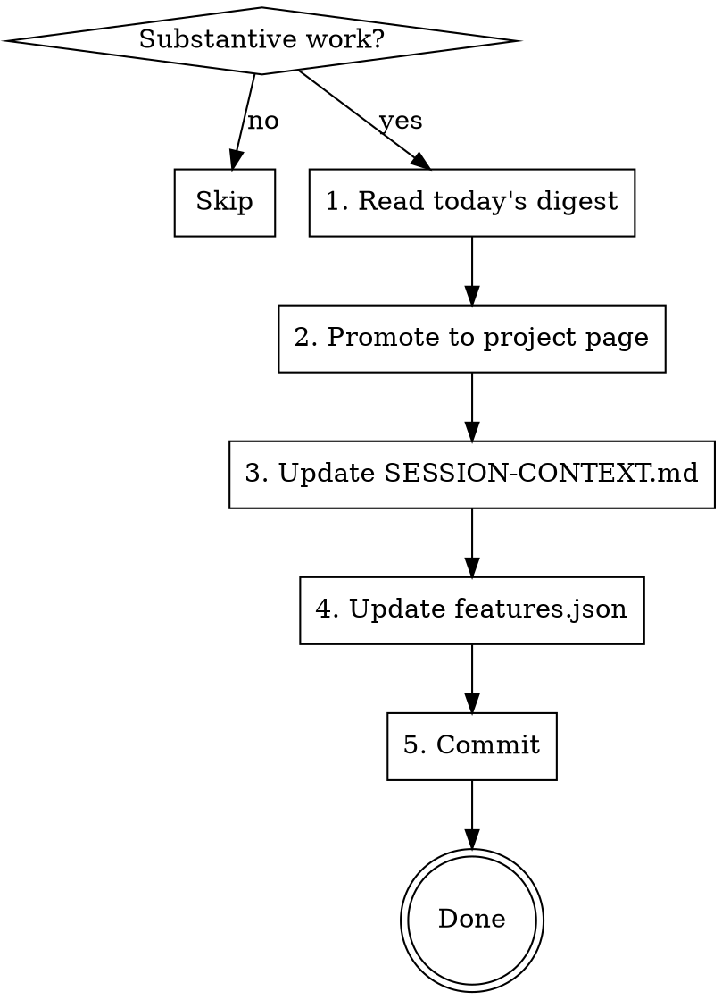

# Session Wrapup

Close out a substantive work session cleanly. Promote what's durable to long-term notes, update local project state, commit.

> **Vault setup.** Parts of this skill write to a personal knowledge base. If you don't use one, skip the vault steps and keep the SESSION-CONTEXT.md / features.json / commit parts. See the [repo README](../README.md#using-these-skills-with-your-own-notes) for vault setup.

## When to Skip

- Quick Q&A, nothing substantive happened
- Wind-down already completed this session
- No files changed, no decisions made, no tasks progressed

## Process



### 1. Read today's digest (vault users only)

If you run a session-end hook that writes a daily digest to `<vault>/00-Inbox/<YYYY-MM-DD>.md`, read that file. It may have one or more session blocks appended. If it's empty, missing, or you don't run a digest hook, synthesize from conversation context directly.

Also scan for any pre-compact survival notes appended during the session. They may have landed in the project page already.

### 2. Promote to project page (vault users only)

Find the matching project page at `<vault>/10-Projects/<Project>.md`. Append a dated history line under the `## History` section:

```markdown
- **YYYY-MM-DD**: one-sentence summary of what shipped, decided, or unblocked
```

Rules:
- **One line per session, not per commit.** Ruthlessly compress.
- Decisions and lessons are the priority. Process theater is not.
- If the work spans multiple projects, one line on each page.
- Delete the inbox entry once promoted. It lived its life.

For ideas that came up but weren't acted on, write them to `<vault>/40-Ideas/<short-title>.md` instead.

### 3. Update SESSION-CONTEXT.md (project-local)

Rewrite entirely (don't append). Four sections, under 30 lines total:
- `## Status`: current phase, what's working, what's blocked (2-3 lines)
- `## In-Flight`: what's actively being worked on
- `## Key Details`: integration specifics, env notes, things that change
- `## Next Steps`: ordered list of what comes next

SESSION-CONTEXT.md lives in the **project directory**, not any vault. It's ephemeral cross-session state, not long-term knowledge.

### 4. Update features.json (project-local)

- Update statuses for any features that changed (started, completed, blocked)
- Add new features only if identified AND agreed upon in this session
- Update the `updated` field
- Don't touch features that weren't discussed

### 5. Commit

```bash
git add SESSION-CONTEXT.md features.json
# include any other modified project files from the session
git commit -m "chore: session wrapup ... [1-line summary]

Co-Authored-By: Claude <noreply@anthropic.com>"
```

Only push if the user explicitly asks or if this is a trivial config change. Default: commit locally, let the user decide when to push.

## Common Mistakes

- **Appending to SESSION-CONTEXT.md** instead of rewriting (causes bloat)
- **Promoting noise** ... "we discussed X" is not project history
- **Duplicating the hook digest** ... if you run a digest hook, it already wrote the inbox entry. Your job here is promotion, not re-capture.
- **Committing unrelated files** ... run `git status` first
- **Pushing without asking** ... follow the branch workflow
